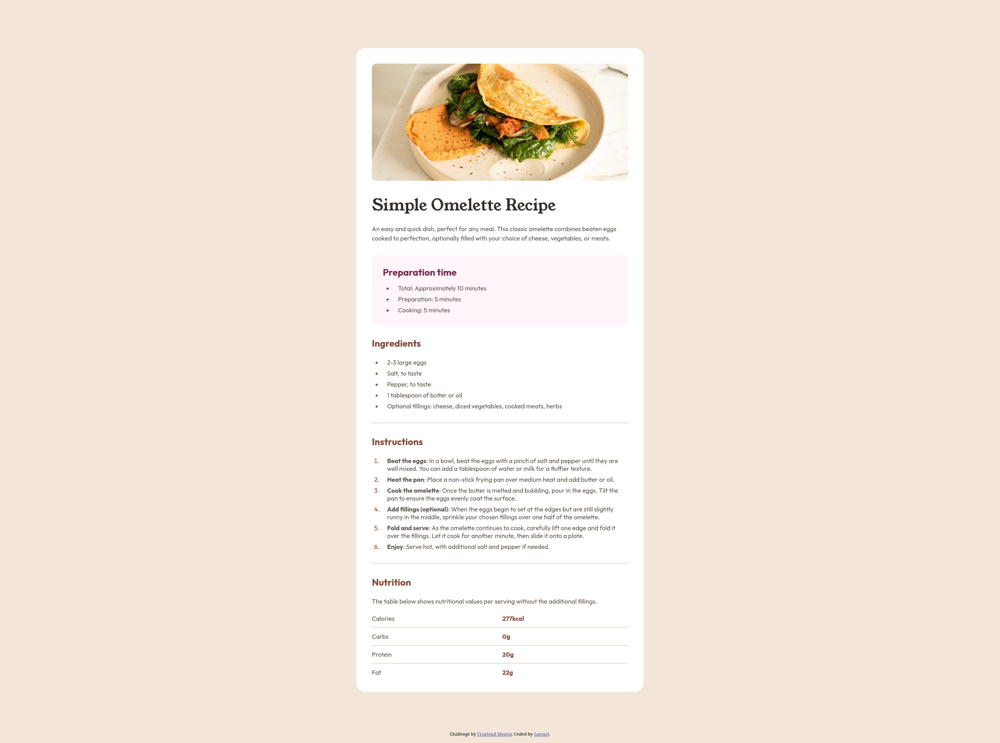
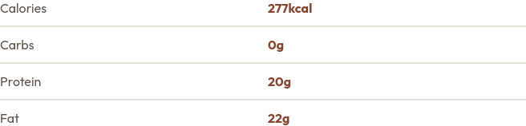

# Frontend Mentor - Recipe page solution

This is a solution to the [Recipe page challenge on Frontend Mentor](https://www.frontendmentor.io/challenges/recipe-page-KiTsR8QQKm). Frontend Mentor challenges help you improve your coding skills by building realistic projects. 

## Table of contents

- [Overview](#overview)
  - [Screenshot](#screenshot)
  - [Links](#links)
- [My process](#my-process)
  - [Built with](#built-with)
  - [What I learned](#what-i-learned)
- [Author](#author)

**Note: Delete this note and update the table of contents based on what sections you keep.**

## Overview

### Screenshot



### Links

- Solution URL: https://github.com/samuel-jm/frontend-mentor-recipe-page
- Live Site URL: https://samuel-jm.github.io/frontend-mentor-recipe-page/

## My process

### Built with

- Semantic HTML5 markup
- CSS custom properties
- CSS Grid

### What I learned

The two main things I learned in this project were:

1. How to manipulate list item markers
    ```css
    li::marker {
      list-style: inside;
    }
    ```
2. How to use CSS Grid, including inserting dividing lines between rows
    ```css
    .table {
      display: grid;

      margin-top: 24px;

      gap: 12px;
      grid-template-columns: repeat(2, 1fr);
    }

    .table-seperator {
      border: 1px solid hsl(30, 18%, 87%);
      grid-column: span 2;
    }
    ```
    

## Author

- Github - https://github.com/samuel-jm
- Frontend Mentor - [@samuel-jm](https://www.frontendmentor.io/profile/samuel-jm)